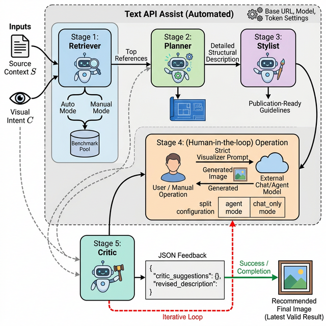

# 项目说明（中文）

## 1. 项目定位

本项目是一个 **PaperBanana 手动可视化闭环版本（Manual Visualizer Bridge）**：
- 文本阶段（Retriever / Planner / Stylist / Critic）可手动或通过 Text API 自动执行；
- 可视化阶段（Visualizer）改为手动调用你自己的聊天模型或 Agent 出图，再上传图片回到流程；
- 保留原始多阶段状态机与迭代机制，适合没有稳定图片 API 的环境。
- 目标用户是只有聊天界面、或 API 仅支持文本而不支持图片生成的使用者。

## 2. 致谢与来源

本项目基于以下开源项目的思路与代码结构进行改造，特此感谢原作者团队：

- **PaperBanana**: https://github.com/dwzhu-pku/PaperBanana
- （PaperBanana README 中也提到其早期来源）**PaperVizAgent**: https://github.com/google-research/papervizagent

感谢这些项目为自动学术绘图提供了完整的多智能体流程框架。

## 3. 项目结构图

下图为本项目流程结构图（由你提供）：



## 4. 工作流程（端到端）

### 阶段顺序

- Retriever（可选）
- Planner
- Stylist（`demo_full` 模式）
- Visualizer（手动出图并上传）
- Critic
- 多轮迭代后完成

### 核心逻辑

1. 在 `Init Run` 设置任务、检索模式、轮数、交互模式（`chat_only` 或 `agent`）。
2. Retriever 阶段：
   - `auto`：可一键 API 跑完 chunk + final top10；
   - `manual`：你手动粘贴 top10 JSON。
3. Planner / Stylist / Critic：可使用 Text API Assist 自动调用文本模型并回填。
4. Visualizer：
   - 系统给出严格 prompt；
   - 你在外部模型生成图片；
   - 上传回本系统进入下一阶段。
5. Critic 给出 JSON（`critic_suggestions`, `revised_description`），状态机进入下一轮 visualizer，直到结束。

## 5. 快速使用

1. 安装依赖：

```bash
python -m venv .venv
.venv\Scripts\activate
pip install -r requirements.txt
```

2. 启动网页：

```bash
streamlit run tools/chat_bridge/web_app.py
```

3. 数据准备（与原项目一致）：
- 下载地址（HuggingFace）：https://huggingface.co/datasets/dwzhu/PaperBananaBench
- 将 `PaperBananaBench` 放在 `data/PaperBananaBench/`。

4. 可选：生成内置参考图库（本地）：

```bash
python scripts/prepare_reference_gallery.py
```
